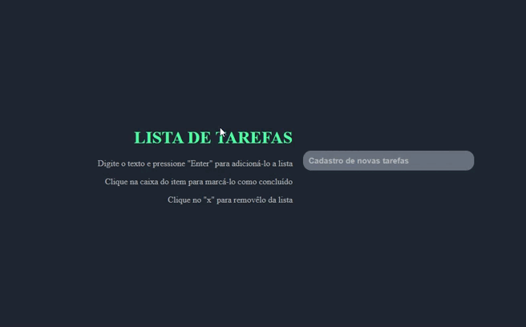

# Projeto da mentoria 2ª Semana (LISTA DE TAREFAS)

 Proposta de projeto para sanar problemas com organização de tarefas diárias. Atividade de Mentoria.

 
 
 :fire: Proposta do projeto :nerd_face:

 <h1 align="center"> 
  
</h1>

O que acha de acessar o projeto? 
 <a href="https://oscarlojr.github.io/to_do_list/" target="_blank">Tela Inicial</a>
